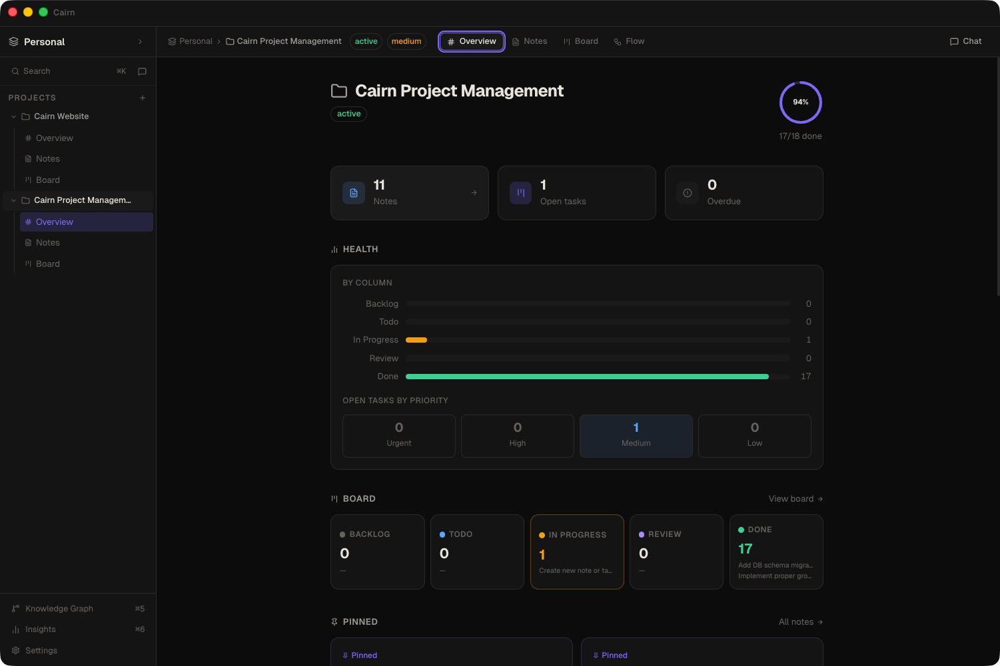
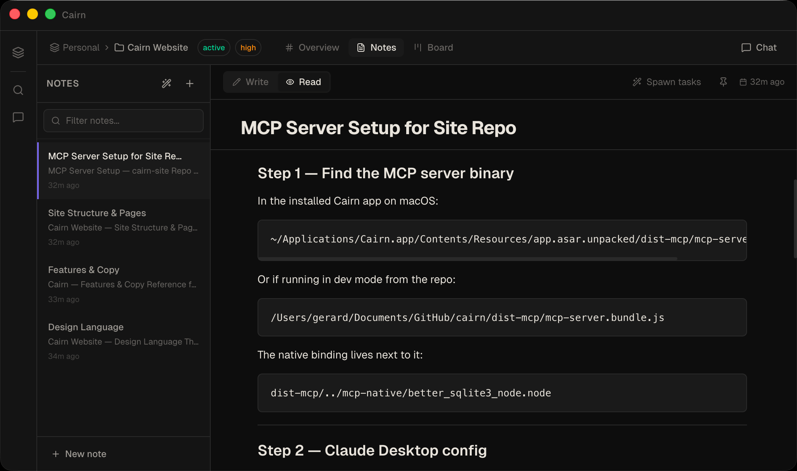
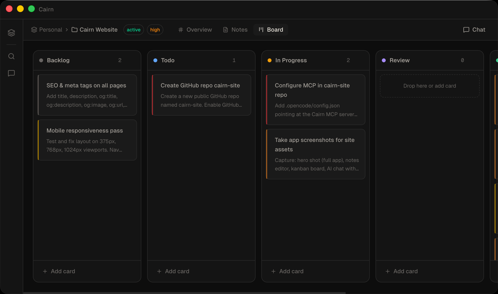
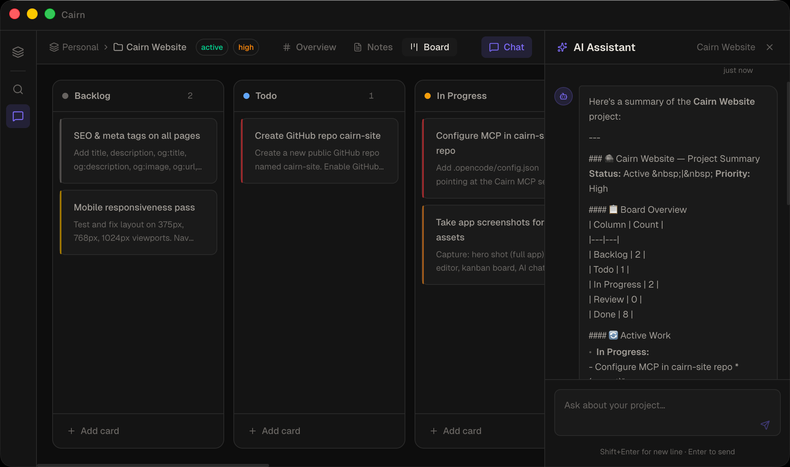
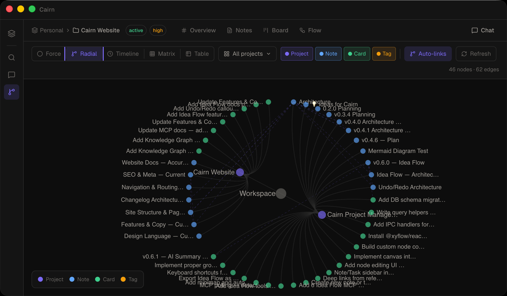
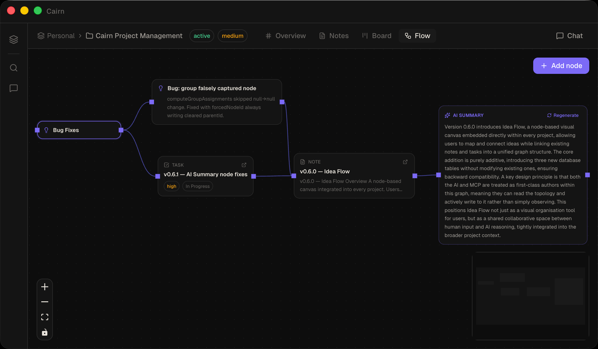

# Cairn

<p align="center">
  
</p>

> A calm, local-first workspace for notes, project tracking, and visual idea mapping — with an AI assistant and MCP server built in.

<p align="center">
  <a href="https://ddutchie.github.io/cairn-site/index.html"></a>
  <a href="https://ddutchie.github.io/cairn-site/docs"></a>
  <a href="https://github.com/ddutchie/cairn/releases"></a>
  <a href="https://deepwiki.com/ddutchie/cairn/"></a>
</p>

<p align="center">
  
</p>

## Overview

Cairn is a desktop app (Electron + Next.js) that combines markdown notes with a kanban board. Notes are saved as plain `.md` files in a folder you choose; project and task data lives in a local SQLite database alongside them. No accounts, no cloud, no backend. An embedded AI assistant and a standalone MCP server let AI agents read and write your workspace directly.

## Features

- **Projects** — Multiple projects inside a workspace, each with notes and a board
- **Notes** — Split-pane markdown editor (write on the left, preview on the right)
- **AI text actions** — Select any text in a note → floating toolbar → Rephrase, Summarize, Expand, Fix Grammar, Change Tone, or custom prompt
- **Kanban board** — Drag-and-drop cards across columns with priority indicators
- **Drag notes into folders** — Drag any note in the sidebar directly onto a folder row to move it; a "Move to root" drop zone appears while dragging
- **Linked context** — Notes and cards reference each other bidirectionally
- **Global search** — Instant full-text search across all notes and tasks (`⌘K` or `⌘⇧F`)
- **AI chat** — Integrated assistant with live project context; reads and writes your data (`⌘/`); supports inline `ask_questions` forms for structured clarification
- **Interactive PRD generation** — Describe what you want to build; the agent reads your project context, asks targeted clarifying questions via an inline form, then writes and saves a full PRD to your notes
- **Idea Flow** — A freeform node canvas per project (`⌘4`): add idea, note reference, task reference, group, URL, and AI summary nodes; connect them with labelled edges; the AI and MCP can read and write the canvas as first-class authors
- **Live dashboards** — Ask the AI to generate an interactive HTML dashboard for any project; choose from a template gallery or start blank; dashboards fetch live data on every load via a sandboxed `window.cairn.query()` bridge; runtime errors surface an inline "Fix with AI" button; HTML editable directly via a built-in CodeMirror overlay
- **MCP server** — Exposes your workspace to external AI agents (OpenCode, Claude Desktop, etc.) via the Model Context Protocol
- **Agent workspace** — Dedicated three-pane view (`⌘5`) for running AI coding agents (Claude Code, OpenCode, Aider, or any CLI binary) connected directly to project tasks. Spawn from a kanban card or ad-hoc. Includes a resizable file tree with `⌘⇧F` filename search, multi-file CodeMirror 6 editor (syntax highlighting, `⌘S` save, `⌘F` find/replace, markdown preview, image viewer), xterm.js terminal with persistent sessions, and a git diff viewer (unified / split / changes-only modes with syntax highlighting)
- **Knowledge Graph** — Workspace-wide graph of every note, card, project, and tag; Force-directed and Radial tree layouts; auto-discovered relationships (`⌘6`)
- **Insights** — Analytics view: Ridgeline joy plot, Beeswarm, Bullet health bars, Sankey pipeline flow, Timeline, Matrix heatmap, Table (`⌘7`)
- **Font scaling** — Five-step UI font size preference (XS–XL, default M) in Settings → General
- **Local-first** — Notes as `.md` files, project data in SQLite; no network required
- **Dark mode** — Calm, focused aesthetics

## Screenshots

<table>
  <tr>
    <td></td>
    <td></td>
  </tr>
  <tr>
    <td></td>
    <td></td>
  </tr>
  <tr>
    <td colspan="2"></td>
  </tr>
</table>

## Getting started

### Prerequisites

- Node.js 20+
- macOS (arm64 build provided; Windows/Linux untested)

### Install and run in development

```bash
git clone https://github.com/YOUR_ORG/cairn
cd cairn
npm install
npm run rebuild   # build better-sqlite3 native binaries for Electron + system Node
npm run compile   # compile Electron main process + bundle MCP server
npm run dev       # start Cairn (Next.js + Electron)
```

### Build the packaged app

```bash
npm run build:mac      # macOS DMG (arm64 + x64)
npm run build:win      # Windows NSIS installer (x64 + arm64)
npm run build:linux    # Linux AppImage (x64 + arm64)
npm run build:all      # All three platforms
```

Output goes to `dist-app/`.

> **Note:** `npm run rebuild` must be re-run after updating the Electron version. It builds three native binaries: one for the Electron ABI (`electron-native/`), one for the Node 22 ABI used by the MCP binary (`pkg-native/`), and one for the current system Node ABI used by vitest (`vitest-native/`). The MCP server is then bundled into a self-contained binary by `scripts/build-mcp-binary.js` — no separate Node installation needed to run it.

## AI chat setup

Configure the AI endpoint in **Settings → AI & Chat** (no restart needed):

| Setting | Default | Notes |
|---------|---------|-------|
| Base URL | `https://api.openai.com` | Any OpenAI-compatible endpoint |
| Model | `gpt-4o-mini` | Any model name the endpoint accepts |
| API Key | _(blank)_ | Not required for local endpoints |

**Quick presets** — one click to switch between OpenAI, Ollama (`localhost:11434`), and LM Studio (`localhost:1234`). Local servers don't need an API key.

## MCP server

Cairn ships a standalone stdio MCP server as a self-contained binary (`dist-mcp/cairn-mcp`), built with `@yao-pkg/pkg`. It connects directly to the same SQLite database as the app — writes are reflected in the UI in real time via WAL polling.

### Connect from OpenCode

Add to `opencode.json` in your project root:

```json
{
  "mcp": {
    "cairn": {
      "type": "local",
      "command": ["/Applications/Cairn.app/Contents/Resources/app.asar.unpacked/dist-mcp/cairn-mcp"],
      "enabled": true
    }
  }
}
```

### Connect from Claude Desktop

Add to `~/Library/Application Support/Claude/claude_desktop_config.json`:

```json
{
  "mcpServers": {
    "cairn": {
      "command": "/Applications/Cairn.app/Contents/Resources/app.asar.unpacked/dist-mcp/cairn-mcp"
    }
  }
}
```

> The exact paths above are generated automatically in **Settings → AI & Chat → MCP Server** — copy them from there.

### Available MCP tools

**Context**

| Tool | Category | Description |
|------|----------|-------------|
| `get_cairn_context` | read | Full orientation: workspaces, projects, column IDs, tool list, conventions |
| `get_project_context_pack` | read | Single-call bundle: project metadata + pinned notes + open tasks + recent activity |
| `resolve_project` | read | Find a project by name (fuzzy) and return its projectId and column IDs |
| `get_project_summary` | read | Column breakdown, card counts, pinned notes, recent activity |
| `list_recent_activity` | read | Recently created/updated notes and tasks |

**Notes**

| Tool | Category | Description |
|------|----------|-------------|
| `get_note` | read | Full markdown content, linked IDs, and metadata of a note by ID |
| `list_notes` | read | List all notes in a project |
| `search_notes` | read | Full-text search across notes |
| `create_note` | write | Create a markdown note |
| `import_note_from_file` | write | Import a local file as a note — server reads from disk, no need to inline content |
| `ensure_note` | write | Idempotent create-or-update by title — prevents duplicate notes on re-run |
| `append_to_note` | write | Append content to a note without re-sending the full body |
| `patch_note` | write | Surgically replace a string inside a note — no need to re-send the full content |
| `update_note` | write | Update a note's title, content, or pinned state |
| `move_note` | write | Move a note to a different project |
| `delete_note` | delete | Permanently delete a note |

**Tasks**

| Tool | Category | Description |
|------|----------|-------------|
| `get_task` | read | Full task detail by ID — includes `blockedByIds` |
| `list_tasks` | read | All tasks in a project grouped by column |
| `list_ready_tasks` | read | Only unblocked, active tasks — use this to find work that can start now |
| `search_tasks` | read | Full-text search across task cards |
| `create_task` | write | Create a task card in a column |
| `update_task` | write | Update a task's title, description, priority, due date, column, or assignee |
| `update_task_status` | write | Move a single task to a different column |
| `bulk_update_task_status` | write | Move multiple tasks to the same column in one call |
| `link_note_to_task` | write | Bidirectionally link a note and a task |
| `block_task` | write | Mark a task as blocked by another task in the same project |
| `unblock_task` | write | Remove a blocking dependency between two tasks |
| `delete_task` | delete | Permanently delete a task card |

**Projects**

| Tool | Category | Description |
|------|----------|-------------|
| `create_project` | write | Create a project with default board columns |
| `update_project` | write | Update a project's name, description, status, priority, or due date |
| `delete_project` | delete | Permanently delete a project and all its contents |

**Dashboards**

| Tool | Category | Description |
|------|----------|-------------|
| `create_dashboard` | write | Create a live HTML dashboard in a project |
| `update_dashboard` | write | Update an existing dashboard's title or HTML |
| `get_dashboard_constants` | read | Returns the `window.cairn` query API reference for building dashboards |

**Idea Flow**

| Tool | Category | Description |
|------|----------|-------------|
| `get_idea_flow` | read | Full Idea Flow graph: nodes (with resolved note/task content) + edges |
| `get_idea_flow_rules` | read | Returns node type conventions, data shapes, group rules, and positioning tips |
| `create_idea_flow_node` | write | Add a node to the canvas (idea, note_ref, task_ref, group, url, ai_summary) |
| `update_idea_flow_node` | write | Update a node's data and/or position (data fields are merged) |
| `layout_idea_flow` | write | Auto-arrange all nodes with Dagre. Call after bulk-creating nodes |
| `create_idea_flow_edge` | write | Connect two nodes with an optional label |
| `delete_idea_flow_node` | delete | Remove a node and its connected edges |
| `delete_idea_flow_edge` | delete | Remove a connection |

**Knowledge Graph**

| Tool | Category | Description |
|------|----------|-------------|
| `get_knowledge_graph` | read | Full workspace graph: projects, notes, cards, tags as nodes + edges |
| `get_neighbors` | read | N-hop neighbourhood around a single node |

**Tags**

| Tool | Category | Description |
|------|----------|-------------|
| `create_tag` | write | Create a workspace tag with a name and hex colour |

> **Agent tip:** call `get_cairn_context` at the start of a session for all workspace/project/column IDs. Use `list_ready_tasks` instead of `list_tasks` when you want to know what work can actually start — it filters out anything blocked by an unresolved dependency.

## Keyboard shortcuts

| Shortcut | Action |
|----------|--------|
| `⌘K` | Open global search |
| `⌘⇧F` | Global search (any view) / File search in Agent view sidebar |
| `⌘F` | In-context search — find/replace in Note or Agent editor; filter in Notes list, Board, or Knowledge Graph |
| `⌘N` | New note (switches to Notes view) |
| `⌘/` | Toggle AI chat |
| `⌘\` | Toggle sidebar |
| `⌘1` | Project overview |
| `⌘2` | Notes view |
| `⌘3` | Board view |
| `⌘4` | Idea Flow canvas |
| `⌘5` | Agent workspace |
| `⌘6` | Knowledge Graph |
| `⌘7` | Insights |
| `⌘S` | Save file (Agent editor) |
| `⌘Z` | Undo |
| `⌘⇧Z` / `⌘Y` | Redo |
| `Esc` | Close modal / search / filter bar |

## Architecture

Cairn is an Electron + Next.js desktop app with two processes that share a single SQLite database (WAL mode), plus a separately-invokable MCP binary for external agent access:

- **Renderer** (`src/`) — React/Next.js. Never touches the filesystem or database directly. All data flows through IPC via `window.electron.*`.
- **Main process** (`electron/`) — Node.js. Owns SQLite, file I/O, the AI chat loop, and PTY sessions for coding agents.
- **MCP server** (`electron/mcp-server.ts`) — a self-contained binary connecting external AI agents (OpenCode, Claude Desktop, etc.) to the same database via WAL polling.

Notes are plain `.md` files with YAML frontmatter; SQLite is the read/search cache. A chokidar file watcher syncs external edits back automatically. The **Agent workspace** (`⌘5`) runs coding agent CLIs via `node-pty` PTY sessions, with all file I/O path-validated against registered project `code_directory` values.

State in the renderer is managed by Zustand domain slices (`ui`, `workspace`, `board`, `notes`, `tags`, `chat`, `graph`, `selectors`), composed in `src/store/index.ts`. Analytics canvases in Insights follow a shared pattern: `useContainerDims` + `useScopedData` + `useFontScale` + D3/SVG rendering.

For the full architecture reference — process model, storage split, data model, dashboard rendering, write paths, font scaling, analytics canvas pattern, and key files — see [CONTRIBUTING.md](CONTRIBUTING.md#architecture).

## Testing

### Unit & integration tests (Vitest)

```bash
npm test              # run all tests
npm run test:watch    # watch mode
npm run test:coverage # coverage report
```

Tests live alongside the code they cover:

| File | Tests | What's covered |
|------|-------|---------------|
| `electron/db/queries.test.ts` | 22 | SQLite query helpers — CRUD, search, soft-delete, snapshot |
| `electron/notes-files.test.ts` | 29 | File I/O, slug generation, frontmatter round-trip (tmp dirs) |
| `electron/mcp-server.test.ts` | 134 | MCP `executeTool` end-to-end via in-memory SQLite — all tools, edge cases, blocker chains |
| `electron/ipc/chat-executor.test.ts` | 98 | Every tool case in the AI chat executor — happy path, missing entities, error returns |
| `electron/ipc/handlers.test.ts` | 14 | IPC data layer — `executeReadTool`, `buildContextResponse`, `getBy*` queries |
| `electron/ipc/tool-parity.test.ts` | 33 | Cross-executor key parity between MCP and chat paths for all shared tools |

### E2E smoke tests (Playwright)

```bash
npm run test:e2e         # headless Chromium (starts Next.js dev server automatically)
npm run test:e2e:ui      # Playwright UI mode — interactive, with time-travel debugger
npm run test:e2e:headed  # headed run for local debugging
```

The E2E suite runs against the Next.js dev server with a full `window.electron` IPC mock injected before React boots — no Electron or packaged app required. It covers app boot, crash-free render of all 8 views, and sidebar content. Runs in ~10s.

**Run the E2E suite before cutting a release** to catch renderer crashes that unit tests can't reach.

## Tech stack

**Platform**

| Tool | Role |
|------|------|
| Electron | Desktop shell |
| Next.js 16 | UI framework (App Router, static export) |
| TypeScript | Language |
| esbuild | Bundler (Electron main + MCP binary) |
| vitest | Unit & integration test runner |
| Playwright | E2E smoke tests (browser, no Electron required) |

**Data & AI**

| Tool | Role |
|------|------|
| better-sqlite3 | SQLite (dual ABI: Electron + pkg/Node 22) |
| gray-matter | YAML frontmatter parsing for note files |
| chokidar | File watcher for external `.md` edits |
| Vercel AI SDK | AI streaming utilities |
| @modelcontextprotocol/sdk | MCP server |
| Zod | Schema validation |
| nanoid | ID generation |

**UI & State**

| Tool | Role |
|------|------|
| Tailwind CSS v4 | Styling (CSS custom properties; never raw colour names) |
| Zustand | State management (domain slices: ui, workspace, board, notes, tags, chat, graph) |
| Radix UI | Accessible UI primitives (dialog, dropdown, tooltip, popover, select, context menu) |
| Lucide React | Icons |
| cmdk | Command palette |
| react-day-picker | Date picker |
| date-fns | Date utilities |
| tailwind-merge | Tailwind class merge utility |

**Editor & Agent**

| Tool | Role |
|------|------|
| CodeMirror 6 | Note editor + Agent file editor (CM6, CSS-hidden-per-tab pattern) |
| @codemirror/search | In-editor find/replace panel (`⌘F`) |
| node-pty | PTY process spawning (Agent terminal) |
| @xterm/xterm | Terminal emulator (Agent view) |
| @xterm/addon-fit | Terminal auto-resize |
| parse-diff | Git diff parser (Agent diff viewer) |

**Visualisation**

| Tool | Role |
|------|------|
| @xyflow/react | Node-based canvas (Idea Flow) |
| dnd-kit | Drag and drop (Kanban) |
| D3 v7 | Analytics & graph visualisation (Insights canvases, Radial tree) |
| react-force-graph-2d | Force-directed graph canvas (Knowledge Graph) |
| d3-sankey | Sankey pipeline diagram (Insights) |
| @dagrejs/dagre | Graph auto-layout (Idea Flow) |

**Markdown**

| Tool | Role |
|------|------|
| react-markdown | Markdown preview |
| remark-gfm | GitHub Flavored Markdown |
| remark-breaks | Hard line breaks in markdown |
| remark-math / rehype-katex | Math expression rendering |
| Mermaid | Diagram rendering in notes |
| lowlight | Syntax highlighting in code blocks |

> The **Settings → About** screen in the app shows real installed versions grouped by category (Platform, Data, AI, UI, Editor, Agent, Visualisation) and all open source licenses. These are generated automatically at build time — see below.

## About screen & license generation

The About section in Settings is populated from `src/generated/licenses.json`, which is generated by `scripts/generate-licenses.js` before each build. It reads installed versions and license identifiers directly from `node_modules` — so it is always accurate and never needs manual updates.

### When to run it

It runs automatically as part of `npm run build:*` and `npm run dev`. You should not need to run it manually unless you want to preview changes to the About screen without starting the full dev server:

```bash
node scripts/generate-licenses.js
```

`src/generated/` is `.gitignore`d since it is build output.

### Adding a new dependency

If you add a package that should appear in the **Stack** grid in the About screen (not just the full license list), add an entry to the `ROLE_MAP` object in `scripts/generate-licenses.js`:

```js
// scripts/generate-licenses.js — ROLE_MAP
"your-package-name": ["Display Name", "Short role description", "Category"],
```

The key must exactly match the package name in `package.json`. Valid categories are `Platform`, `Data`, `AI`, `UI`, `Editor`, `Agent`, and `Visualisation` — entries are grouped under these headings in the About screen. All installed packages (whether in `ROLE_MAP` or not) are automatically included in the full **Open Source Licenses** list.

## Star History
<p align="center">
<a href="https://www.star-history.com/?repos=ddutchie%2Fcairn&type=date&legend=top-left">
 <picture>
   <source media="(prefers-color-scheme: dark)" srcset="https://api.star-history.com/chart?repos=ddutchie/cairn&type=date&theme=dark&legend=top-left" />
   <source media="(prefers-color-scheme: light)" srcset="https://api.star-history.com/chart?repos=ddutchie/cairn&type=date&legend=top-left" />
   
 </picture>
</a>
</p>

## License

MIT — see [LICENSE](LICENSE).