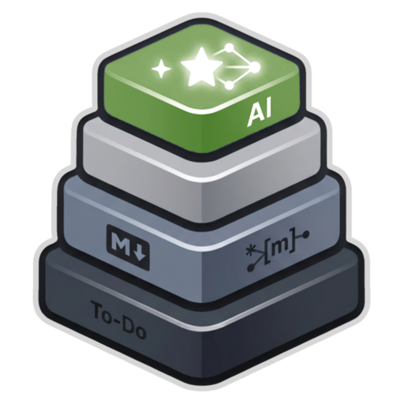

# Cairn

<p align="center">
  
</p>

> A calm, local-first workspace for notes and project tracking — with an AI assistant and MCP server built in.

## Overview

Cairn is a desktop app (Electron + Next.js) that combines markdown notes with a kanban board. Notes are saved as plain `.md` files in a folder you choose; project and task data lives in a local SQLite database alongside them. No accounts, no cloud, no backend. An embedded AI assistant and a standalone MCP server let AI agents read and write your workspace directly.

## Features

- **Projects** — Multiple projects inside a workspace, each with notes and a board
- **Notes** — Split-pane markdown editor (write on the left, preview on the right)
- **AI text actions** — Select any text in a note → floating toolbar → Rephrase, Summarize, Expand, Fix Grammar, Change Tone, or custom prompt
- **Kanban board** — Drag-and-drop cards across columns with priority indicators
- **Linked context** — Notes and cards reference each other bidirectionally
- **Global search** — Instant full-text search across all notes and tasks (`⌘K`)
- **AI chat** — Integrated assistant with live project context; reads and writes your data (`⌘/`)
- **Live dashboards** — Ask the AI to generate an interactive HTML dashboard for any project; dashboards fetch live data on every load via a sandboxed `window.cairn.query()` bridge
- **MCP server** — Exposes your workspace to external AI agents (OpenCode, Claude Desktop, etc.) via the Model Context Protocol
- **Local-first** — Notes as `.md` files, project data in SQLite; no network required
- **Dark mode** — Calm, focused aesthetics

## Getting started

### Prerequisites

- Node.js 20+
- macOS (arm64 build provided; Windows/Linux untested)

### Install and run in development

```bash
git clone https://github.com/YOUR_ORG/cairn
cd cairn
npm install
npm run rebuild   # build better-sqlite3 native binaries for Electron + system Node
npm run compile   # compile Electron main process + bundle MCP server
npm run dev       # start Cairn (Next.js + Electron)
```

### Build the packaged app

```bash
npm run build:mac      # macOS DMG (arm64 + x64)
npm run build:win      # Windows NSIS installer (x64 + arm64)
npm run build:linux    # Linux AppImage (x64 + arm64)
npm run build:all      # All three platforms
```

Output goes to `dist-app/`.

> **Note:** `npm run rebuild` must be re-run after updating the Electron version. It builds three native binaries: one for the Electron ABI (`electron-native/`), one for the Node 22 ABI used by the MCP binary (`pkg-native/`), and one for the current system Node ABI used by vitest (`vitest-native/`). The MCP server is then bundled into a self-contained binary by `scripts/build-mcp-binary.js` — no separate Node installation needed to run it.

## AI chat setup

Configure the AI endpoint in **Settings → AI & Chat** (no restart needed):

| Setting | Default | Notes |
|---------|---------|-------|
| Base URL | `https://api.openai.com` | Any OpenAI-compatible endpoint |
| Model | `gpt-4o-mini` | Any model name the endpoint accepts |
| API Key | _(blank)_ | Not required for local endpoints |

**Quick presets** — one click to switch between OpenAI, Ollama (`localhost:11434`), and LM Studio (`localhost:1234`). Local servers don't need an API key.

## MCP server

Cairn ships a standalone stdio MCP server as a self-contained binary (`dist-mcp/cairn-mcp`), built with `@yao-pkg/pkg`. It connects directly to the same SQLite database as the app — writes are reflected in the UI in real time via WAL polling.

### Connect from OpenCode

Add to `opencode.json` in your project root:

```json
{
  "mcp": {
    "cairn": {
      "type": "local",
      "command": ["/Applications/Cairn.app/Contents/Resources/app.asar.unpacked/dist-mcp/cairn-mcp"],
      "enabled": true
    }
  }
}
```

### Connect from Claude Desktop

Add to `~/Library/Application Support/Claude/claude_desktop_config.json`:

```json
{
  "mcpServers": {
    "cairn": {
      "command": "/Applications/Cairn.app/Contents/Resources/app.asar.unpacked/dist-mcp/cairn-mcp"
    }
  }
}
```

> The exact paths above are generated automatically in **Settings → AI & Chat → MCP Server** — copy them from there.

### Available MCP tools

| Tool | Category | Description |
|------|----------|-------------|
| `get_cairn_context` | read | Full orientation: workspaces, projects, column IDs, tool list, conventions |
| `search_notes` | read | Full-text search across notes |
| `search_tasks` | read | Full-text search across task cards |
| `get_note` | read | Full markdown content of a note by ID |
| `get_task` | read | Full detail of a task card by ID |
| `get_project_summary` | read | Column breakdown, card counts, recent activity |
| `list_notes` | read | List all notes in a project |
| `list_tasks` | read | List all tasks grouped by column |
| `list_recent_activity` | read | Recently created/updated notes and tasks |
| `create_project` | write | Create a project with default board columns |
| `update_project` | write | Update a project's name, status, priority, or due date |
| `create_note` | write | Create a markdown note |
| `update_note` | write | Update a note's title or content |
| `create_task` | write | Create a task card in a column |
| `update_task` | write | Update a task's title, description, priority, due date, column, or assignee |
| `update_task_status` | write | Move a task to a different column |
| `link_note_to_task` | write | Bidirectionally link a note and task |
| `create_dashboard` | write | Create a live HTML dashboard in a project |
| `update_dashboard` | write | Update an existing dashboard's title or HTML |
| `delete_note` | delete | Permanently delete a note |
| `delete_task` | delete | Permanently delete a task card |
| `delete_project` | delete | Permanently delete a project and all its contents |

> Call `get_cairn_context` at the start of a session — it returns all workspace/project/column IDs and conventions in one call.

## Keyboard shortcuts

| Shortcut | Action |
|----------|--------|
| `⌘K` | Open global search |
| `⌘/` | Toggle AI chat |
| `⌘\` | Toggle sidebar |
| `⌘1` | Project overview |
| `⌘2` | Notes view |
| `⌘3` | Board view |
| `Esc` | Close modal / search |

## Architecture

### Workspace folder

On first launch Cairn asks the user to choose a **workspace folder** — any directory they control (Documents, iCloud Drive, a git repo, etc.). Everything Cairn owns lives inside it:

```
<workspace>/
  cairn.db          ← SQLite: projects, tasks, columns, chat (WAL mode)
  notes/
    <Project Name>/
      <Note Title>.md   ← one file per note, YAML frontmatter + markdown body
```

The workspace path is stored in `<userData>/workspace-config.json` so it survives app updates.

### Storage split

| What | Where | Why |
|------|-------|-----|
| Notes content | `.md` files | Human-readable, portable, editable in any editor |
| Note metadata | YAML frontmatter in the same `.md` file | Keeps content and metadata together |
| Projects, tasks, columns, chat | `cairn.db` (SQLite) | Relational structure, fast queries, drag-and-drop ordering |
| SQLite search index for notes | `content_text` column in `notes` table | Keeps full-text search fast without parsing files |

Every note write (from the UI, AI chat, or MCP server) writes to **both** the `.md` file and SQLite simultaneously. The SQLite `notes` table is the read cache; the `.md` file is the source of truth for content.

### Note file format

```markdown
---
id: abc123def456
projectId: xyz789
workspaceId: ws001
title: My Note
tagIds: []
linkedNoteIds: []
linkedCardIds: []
isPinned: false
createdAt: 2025-01-01T00:00:00.000Z
updatedAt: 2025-01-01T00:00:00.000Z
---

Note body in plain markdown.
```

The `id` in the frontmatter is the stable identifier — **filenames are derived from the title** and can change when a note is renamed. The file watcher uses frontmatter `id` to match files to SQLite rows.

### Data model

```
Workspace
  └── Project
        ├── Note[]           (.md file + SQLite row, type = "note")
        ├── Dashboard[]      (SQLite row only, type = "dashboard" — HTML stored in content field)
        ├── BoardColumn[]    (SQLite only)
        │     └── TaskCard[] (SQLite only)
        └── ChatThread       (SQLite only)
              └── ChatMessage[]
```

Notes and task cards link bidirectionally via `linkedNoteIds` / `linkedCardIds`.

Dashboards are a specialisation of the `notes` table (`type = 'dashboard'`). Their `content` field holds a complete HTML document rather than markdown, so they are never written to `.md` files.

### Process model

Two processes share the same `cairn.db` (SQLite WAL mode):

1. **Electron app** — Next.js rendered in a BrowserWindow. All DB access goes through IPC to the main process. AI chat runs in the main process (`electron/ipc/chat.ts`) — fully offline in the packaged app.
2. **MCP server** — Self-contained binary (`dist-mcp/cairn-mcp`, built with `@yao-pkg/pkg`), launched by external agents. Reads/writes `cairn.db` directly and writes `.md` files; the Electron UI refreshes automatically via WAL mtime polling.

External `.md` edits (e.g. the user editing a note in another editor) are picked up by a **chokidar file watcher** in the main process, which parses the frontmatter and upserts the SQLite row, then fires `db:changed` to the renderer.

### Dashboard rendering

Dashboards render in a sandboxed `<iframe srcdoc>` inside the Notes panel. The iframe has no network access and no `allow-same-origin` (preventing privilege escalation). A lightweight postMessage bridge — `window.cairn.query(tool, args)` — lets dashboard JavaScript request live data from the main process:

```
Dashboard JS (iframe)
  │  window.cairn.query('list_tasks', { projectId })
  │  postMessage → cairn:query
  ▼
DashboardView (renderer)
  │  window.addEventListener('message') → electron.mcpQuery(tool, args)
  ▼
db:mcpQuery IPC (main process)
  │  runs read-only DB query via queries.ts helpers
  ▼
DashboardView
  │  postMessage → cairn:response { result }
  ▼
Dashboard JS
  └─ receives live data, updates DOM
```

Available query tools inside a dashboard: `get_cairn_context`, `get_project_summary`, `list_tasks`, `list_notes`, `list_recent_activity`, `search_tasks`, `search_notes`.

### Write path for notes and dashboards

```
Note write (UI / chat / MCP)
  │
  ├── writeNoteFile()  → <workspace>/notes/<Project>/<Title>.md
  └── SQLite upsert   → notes table (type='note', content_text re-derived from markdown)

Dashboard write (chat / MCP — create_dashboard / update_dashboard)
  │
  └── SQLite upsert   → notes table (type='dashboard', content = raw HTML)
                        (no .md file written — HTML is not markdown)

External .md edit
  │
  └── chokidar watcher → parseNoteFile() → upsertNoteFromFile() → SQLite
                                                               → db:changed → renderer refresh
```

### Key files

**Electron main process**

| File | Purpose |
|------|---------|
| `electron/main.ts` | Startup orchestrator — BrowserWindow, IPC registration, file watcher |
| `electron/lib/protocol.ts` | `app://` scheme registration + CSP headers |
| `electron/lib/tray.ts` | System tray icon, menu, and badge update logic |
| `electron/lib/mcp-poller.ts` | WAL mtime polling → `db:changed` IPC + MCP notification dispatch |
| `electron/lib/read-tools.ts` | `executeReadTool(db, snap, tool, args)` — shared read dispatch used by chat and dashboard bridge |
| `electron/workspace-config.ts` | Read/write `workspace-config.json`; resolve `cairn.db` path |
| `electron/notes-files.ts` | Note file I/O: `writeNoteFile`, `deleteNoteFile`, `parseNoteFile`, `upsertNoteFromFile` |
| `electron/file-watcher.ts` | chokidar watcher on `notes/`; syncs external `.md` edits to SQLite |
| `electron/ipc/handlers.ts` | All `db:*` and `app:*` IPC channels; wrapped in `handle()` returning `IpcResult<T>` |
| `electron/ipc/chat.ts` | AI chat loop — `runToolLoop` + IPC handler registration |
| `electron/ipc/chat-executor.ts` | `executeTool` — all AI tool implementations |
| `electron/lib/llm.ts` | `LLMConfig`, `callLLM`, `streamCompletion`, `isLocalEndpoint` |
| `electron/lib/tools.ts` | `TOOLS` (OpenAI function definitions), `TOOL_LABELS`, `buildSystemPrompt` |
| `electron/lib/context.ts` | `buildContextResponse` — canonical `get_cairn_context` response |
| `electron/lib/prd.ts` | `generatePrd` — shared PRD generation logic |
| `electron/db/queries.ts` | SQLite query helpers (CRUD, search, snapshot, `getProjectById`, `getNoteById`, `getCardById`) |
| `electron/shared/text-utils.ts` | Pure text helpers shared across the process boundary: `toSlug`, `stripMarkdown` |
| `electron/db/schema.ts` | SQLite DDL + versioned migration runner (`PRAGMA user_version`) |
| `electron/db/utils.ts` | `newId()` (nanoid), `ts()` — shared ID and timestamp helpers |
| `electron/db/defaults.ts` | `DEFAULT_COLUMNS` — canonical 5-column board layout |
| `electron/mcp-server.ts` | Standalone MCP binary; all MCP tools; `getConfigBasePath()` |

**Renderer**

| File | Purpose |
|------|---------|
| `src/store/index.ts` | Zustand store composition + hydration; delegates to domain slices |
| `src/store/slices/` | Domain slices: `ui`, `workspace`, `board`, `notes`, `tags`, `chat`, `selectors` |
| `src/store/ipc.ts` | Shared `isElectron`, `ipc`, `ipcAwait` helpers used by all slices |
| `src/hooks/useChatStream.ts` | AI stream lifecycle hook — subscriptions, loading state, `sendStream` |
| `src/lib/constants.ts` | Shared constants: `COLUMN_COLORS`, `PRIORITY_OPTIONS`, `DEFAULT_AI_CONFIG`, etc. |
| `src/lib/events.ts` | Typed `CairnEvents` helpers for internal custom event dispatch |
| `src/types/index.ts` | All shared types: `IpcResult<T>`, `ProjectSummaryResult`, `DashboardQueryMessage`, etc. |
| `src/components/onboarding/create-workspace.tsx` | First-launch folder picker + workspace creation |
| `src/components/notes/note-editor.tsx` | Split-pane markdown editor + AI text toolbar |
| `src/components/notes/dashboard-view.tsx` | Sandboxed iframe renderer; `window.cairn` postMessage bridge |
| `src/components/notes/dashboard-bootstrap.ts` | Dashboard bootstrap JS builder (`buildBootstrap`, `buildSrcdoc`) |
| `src/components/layout/project-overview/useProjectMetrics.ts` | Derived metrics hook (due dates, priority counts, activity grouping) |
| `src/components/settings/settings-view.tsx` | Settings shell; section components in `settings/` directory |

## Testing

```bash
npm test              # run all tests (vitest)
npm run test:watch    # watch mode
npm run test:coverage # coverage report
```

Tests live alongside the code they cover:

| File | Tests | What's covered |
|------|-------|---------------|
| `electron/db/queries.test.ts` | 22 | SQLite query helpers — CRUD, search, soft-delete, snapshot |
| `electron/notes-files.test.ts` | 29 | File I/O, slug generation, frontmatter round-trip (tmp dirs) |
| `electron/ipc/chat-executor.test.ts` | 21 | Every tool case in `executeTool` — happy path, missing entities, error returns |
| `electron/ipc/handlers.test.ts` | 14 | IPC data layer — `executeReadTool`, `buildContextResponse`, `getBy*` queries |
| `electron/ipc/tool-parity.test.ts` | 7 | Chat/MCP tool name alignment; `get_project_summary` canonical shape |

## Tech stack

| Tool | Role |
|------|------|
| Electron | Desktop shell |
| Next.js 16 | UI framework (App Router, static export) |
| TypeScript | Language |
| Tailwind CSS v4 | Styling |
| Zustand | State management (domain slices) |
| better-sqlite3 | SQLite (dual ABI: Electron + pkg/Node 22) |
| gray-matter | YAML frontmatter parsing for note files |
| chokidar | File watcher for external `.md` edits |
| dnd-kit | Drag and drop |
| CodeMirror 6 | Note editor |
| react-markdown | Markdown preview |
| react-day-picker | Date picker |
| date-fns | Date utilities |
| Radix UI | Accessible UI primitives |
| esbuild | Bundler |
| @modelcontextprotocol/sdk | MCP server |
| Lucide React | Icons |
| Zod | Schema validation |
| nanoid | ID generation |
| vitest | Unit test runner |

> The **Settings → About** screen in the app shows real installed versions and all open source licenses. These are generated automatically at build time — see below.

## About screen & license generation

The About section in Settings is populated from `src/generated/licenses.json`, which is generated by `scripts/generate-licenses.js` before each build. It reads installed versions and license identifiers directly from `node_modules` — so it is always accurate and never needs manual updates.

### When to run it

It runs automatically as part of `npm run build:*` and `npm run dev`. You should not need to run it manually unless you want to preview changes to the About screen without starting the full dev server:

```bash
node scripts/generate-licenses.js
```

`src/generated/` is `.gitignore`d since it is build output.

### Adding a new dependency

If you add a package that should appear in the **Stack** grid in the About screen (not just the full license list), add an entry to the `ROLE_MAP` object in `scripts/generate-licenses.js`:

```js
// scripts/generate-licenses.js — ROLE_MAP
"your-package-name": ["Display Name", "Short role description"],
```

The key must exactly match the package name in `package.json`. The display name and role are what appear in the UI grid. All installed packages (whether in `ROLE_MAP` or not) are automatically included in the full **Open Source Licenses** list.

## License

MIT — see [LICENSE](LICENSE).
