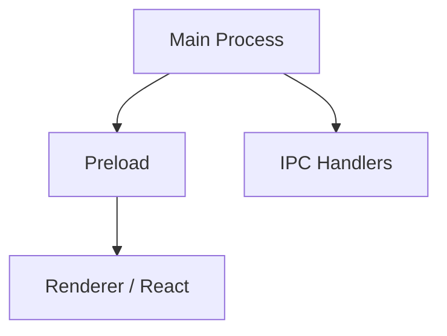

# ArchWiz — Architecture Overview

ArchWiz is an Electron + React desktop app for AI-powered architectural visualisation. Users generate, upscale, compare, and explore renders via a gallery view and a node-based variation canvas.

## Process Model

## Key Components

- Gallery View with masonry layout
- Node-based variation canvas
- AI upscaler integration
